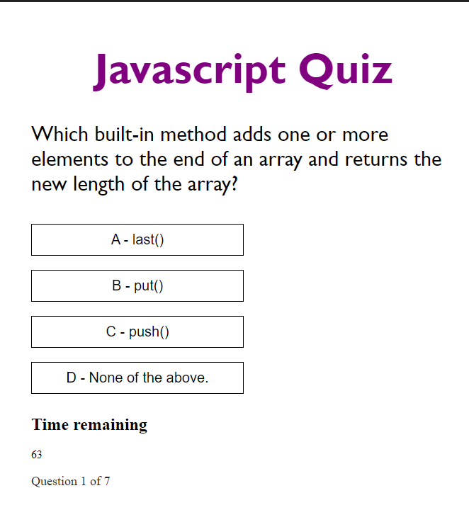

# Javascript-Quiz
This is a timed quiz about java script. 

# Quiz URL https://sushichen.github.io/Javascript-Quiz/

# How to use the Quiz

1) Press the Start button

2) The quiz will start and you will have 75 seconds to finish the following 7 question quiz.

3) After finishing the quiz the following prompt will show that will allow you to input your initals.
   This will show a leaderbourd of the Top people.

4) If you want to clear the leaderbourd you would just press the clear and it will clear the following.

5) To go back and try again for a better score just press the go back button.